# 1.会话安全概述
## 1.1 什么是会话
session会话机制是一种服务器端机制，它使用类似于哈希表（可能还有哈希表）的结构来保存信息。当程序需要为客户端的请求创建会话时，服务器首先检查客户端的请求是否包含会话标识符（称为会话ID）。如果包含它，它先前已为此客户端创建了一个会话。服务器根据会话ID检索会话（无法检索，将创建新会话），如果客户端请求不包含会话ID，则为客户端创建会话并生成与会话关联的会话ID。 session id应该是一个既不重复也不容易被复制的字符串。会话ID将返回给客户端以保存此响应。

## 1.2常见会话问题
### 1.2.1会话预测
即预测应用程序的身份验证模式的会话ID值。通过分析和理解会话ID生成过程，攻击者可以预测有效的会话ID值并获得对应用程序的访问权限。

### 1.2.2会话劫持
通过利用各种手段获取用户Session ID后，使用该Session ID登录网站，获取目标用户的操作权限。

### 1.2.3会话重用
用户退出系统后，服务器端Session未失效，攻击者可利用此Session向服务器继续发送服务请求。
测试方法：登录后将会话注销，再次重放登录时的数据包仍然可正常登录系统。

### 1.2.4会话失效时间过长
应用系统的会话失效时间过长。导致服务器性能受损，且由于过长的失效时间会导致可以被多次利用。
测试方法：系统登录后会话长时间不失效，使用系统功能，仍可正常使用。

### 1.2.5会话固定
在用户进入登录页面，但还未登录时，就已经产生了一个session，用户输入信息，登录以后，session的id不会改变，也就是说没有建立新session，原来的session也没有被销毁）。攻击者事先访问系统并建立一个会话，诱使受害者使用此会话登录系统，然后攻击者再使用该会话访问系统即可登录受害者的账户。
测试方法：系统登录前和登录后，用户的seesion保持不变。

# 2.危害
攻击者可利用漏洞绕过身份验证提升权限。

# 3.测试方法
## 3.1测试靶场介绍
下面介绍两个测试靶场，DVWA靶场和WebGoat靶场。
### 3.1.1 DVWA
#### 3.1.1.1 靶场介绍
DVWA (Damn Vulnerable Web Application) 是用 PHP+MySQL 编写的一套用于漏洞检测和教学的程序，支持多种数据库，包括了 SQL 注入、XSS 等一些常见的安全漏洞。
#### 3.1.1.2 安装过程
下载地址：http://www.dvwa.co.uk/
下载后解压放到WWW目录，配置好本地域名
修改config.inc.php.dist配置文件中的数据库密码，并且把文件后缀.dist去掉
然后访问配置的本地域名，下拉点击Create Database。
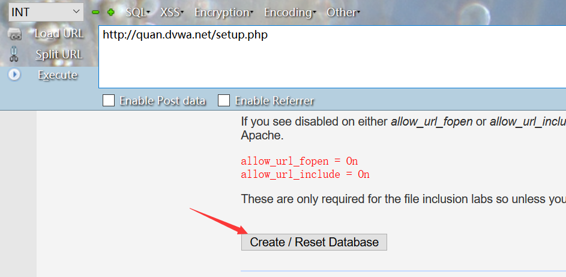

然后登录默认管理员账户：admin/password，出现下图即为安装成功。
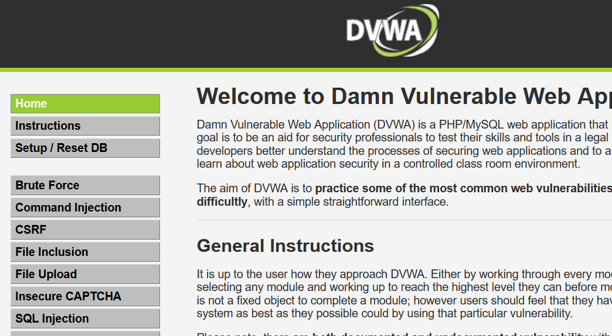

### 3.1.2 WebGoat
WebGoat是OWASP组织研制出的用于进行web漏洞实验的Java靶场程序，用来说明web应用中存在的安全漏洞。WebGoat运行在带有java虚拟机的平台之上，当前提供的训练课程有30多个，其中包括：跨站点脚本攻击（XSS）、访问控制、线程安全、操作隐藏字段、操纵参数、弱会话cookie、SQL盲注、数字型SQL注入、字符串型SQL注入、web服务、Open Authentication失效、危险的HTML注释等等。
Docker方式安装过程：
（1）安装Docker
apt install apt-get install docker.io
（2）查看Docker版本
docker --version
（3）下载WebGoat容器
docker pull webgoat/webgoat-7.1
（4）运行WebGoat
docker run -p 8080:8080 -t webgoat/webgoat-7.1
访问http://127.0.0.1:8080/WebGoat/login，出现下图页面
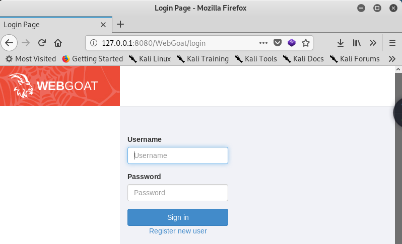

## 3.2手工测试
下面采用DVWA靶场进行手工测试。
### 3.2.1 Low
#### 3.2.1.1 测试过程
使用Firefox登录，默认管理员账户：admin/password
先点击DVWA Security选择测试等级Low，再在Weak Session IDs进行测试。
点击generate生成新的dvwasessionid，多点击几次可以发现，每生成一个dvwasessionid，sessionid+1
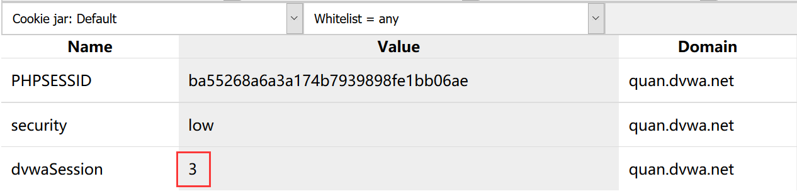
点击generate再刷新
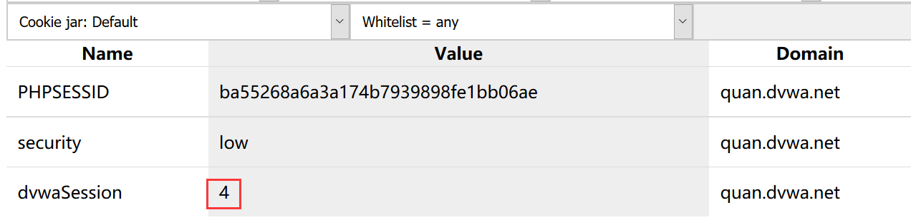

此时使用Google浏览器在未登录时访问http://quan.dvwa.net/vulnerabilities/weak_id/时抓包，然后构造Cookie:
dvwaSession=1; PHPSESSID=ba55268a6a3a174b7939898fe1bb06ae; security=low
（PHPSESSID的值改为Firefox的PHPSESSID），即可进入已登陆页面。
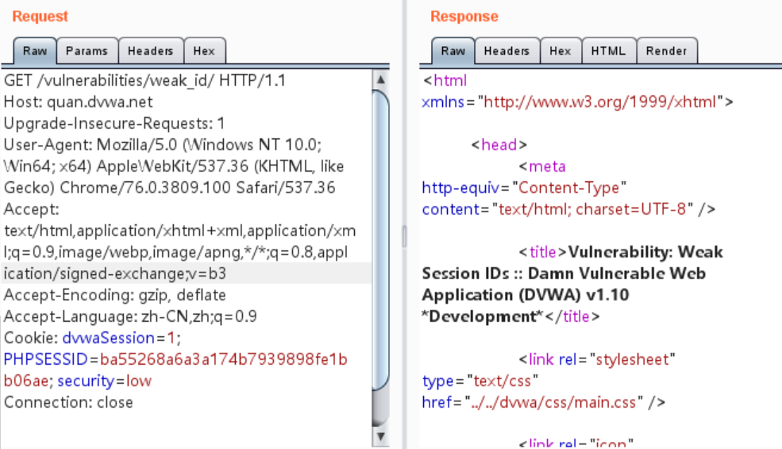

#### 3.2.1.2 源码分析
```
<?php 
$html = ""; 
if ($_SERVER['REQUEST_METHOD'] == "POST") { 
    if (!isset ($_SESSION['last_session_id'])) { 
        $_SESSION['last_session_id'] = 0; 
    } 
    $_SESSION['last_session_id']++; 
    $cookie_value = $_SESSION['last_session_id']; 
    setcookie("dvwaSession", $cookie_value); 
} 
?>
```
从第4行可以知道，当last_session_id不存在时，令它为0；存在last_session_id时，每次加一，last_session_id即dvwaSession。

### 3.2.2 Medium
#### 3.2.2.1 测试过程
同样使用Firefox登录管理员账户，先点击DVWA Security选择测试等级Medium，再在Weak Session IDs进行测试。
点击generate生成新的dvwasessionid，用Cookiemanager查看Cookie可以发现，生成的dvwasessionid很明显就是一个当前时间的时间戳。
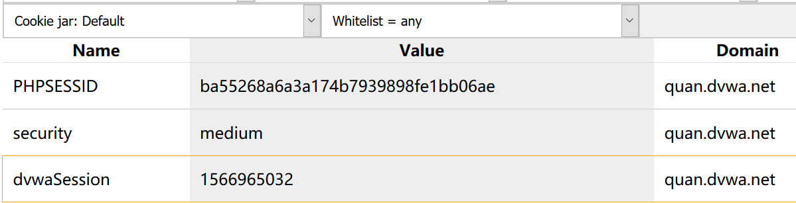
欺骗用户在某个时间点击generate，就能构造这个时间范围的Cookie:
dvwaSession=1566965958;PHPSESSID=ba55268a6a3a174b7939898fe1bb06ae; security=medium
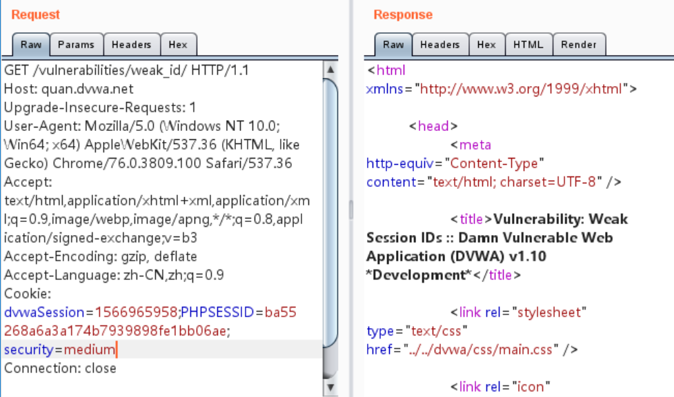

#### 3.2.2.2 源码分析
```
<?php 
$html = ""; 
if ($_SERVER['REQUEST_METHOD'] == "POST") { 
    $cookie_value = time(); 
    setcookie("dvwaSession", $cookie_value); 
} 
?>
```
从第4行代码可以知道，确实就是用时间做的值。

### 3.2.3 High
#### 3.2.3.1 测试过程
同样使用Firefox登录管理员账户，先点击DVWA Security选择测试等级Medium，再在Weak Session IDs进行测试。
点击generate生成新的dvwasessionid，用Cookiemanager查看Cookie可以发现，生成的dvwasessionid进行了加密。
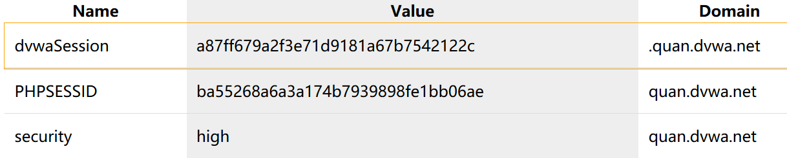

看着好像是MD5，我们试着用MD5解密一下。
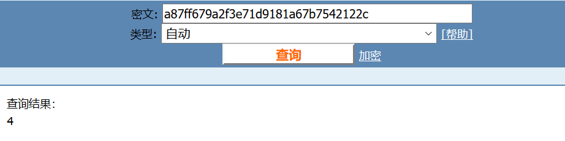
再生成一个sessionid并解密，观察特点好像就是Low等级的MD5加密版。

找到cookie生成规律后就可以构造payload：
Cookie:dvwaSession=e4da3b7fbbce2345d7772b0674a318d5;PHPSESSID=9igf4g7mcnegrv91ro6eq4msj1; security=high
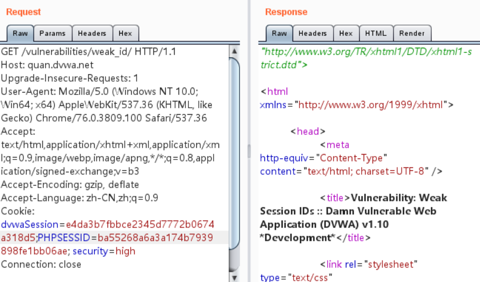

#### 3.2.3.2 源码分析
```
<?php 
$html = ""; 
if ($_SERVER['REQUEST_METHOD'] == "POST") { 
    if (!isset ($_SESSION['last_session_id_high'])) { 
        $_SESSION['last_session_id_high'] = 0; 
    } 
    $_SESSION['last_session_id_high']++; 
    $cookie_value = md5($_SESSION['last_session_id_high']); 
    setcookie("dvwaSession", $cookie_value, time()+3600, "/vulnerabilities/weak_id/", $_SERVER['HTTP_HOST'], false, false); 
}
?>
```
根据源码可知，与Low等级的代码相比较，只是多了MD5加密这一步。并且从setcookie()函数可以知道cookie有效期为当前时间到未来一小时内。

### 3.2.4 Impossible
#### 3.2.4.1 测试过程
同样使用Firefox登录管理员账户，先点击DVWA Security选择测试等级Medium，再在Weak Session IDs进行测试。
点击generate生成dvwasessionid，值为ed880adbdf1fc68b92185e9c5032d5d575bfaee2。尝试MD5失败。遂查看源码。
#### 3.2.4.2 源码分析
```
<?php 
$html = ""; 
if ($_SERVER['REQUEST_METHOD'] == "POST") { 
    $cookie_value = sha1(mt_rand() . time() . "Impossible"); 
    setcookie("dvwaSession", $cookie_value, time()+3600, "/vulnerabilities/weak_id/", $_SERVER['HTTP_HOST'], true, true); 
} 
?>
```
根据第4行代码可以看出，先是连接随机数和时间戳，然后又进行sha1加密，一般破解不出。

#4.CMS实战演练
下面采用XiaoCMS和YxCMS对会话固定漏洞进行实战演练。
## 4.1 XiaoCMS
### 4.1.1CMS介绍
XiaoCms 企业建站版基于 PHP+Mysql 架构 是一款小巧、灵活、简单、易用的轻量级 cms。能满足各种企业站 博客 等中小型站点。

### 4.1.2 CMS安装
CMS版本：XiaoCMSv1.0
下载地址：http://www.a5xiazai.com/php/108347.html
测试环境：win10、PHP5.2.17、Mysql5.5.53
放到www目录下，正确填写数据库信息，然后next即可。
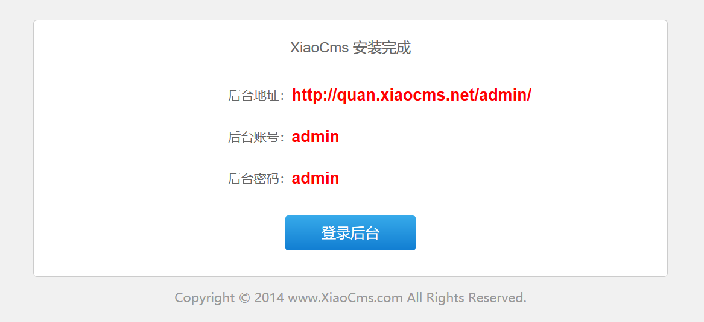

### 4.1.3 CMS漏洞介绍
漏洞发生在此处文件：\core\library\session.class.php
漏洞成因：已经存在sessionid时将该sessionid设置为当前sessionid，没有重新生成。
代码分析：
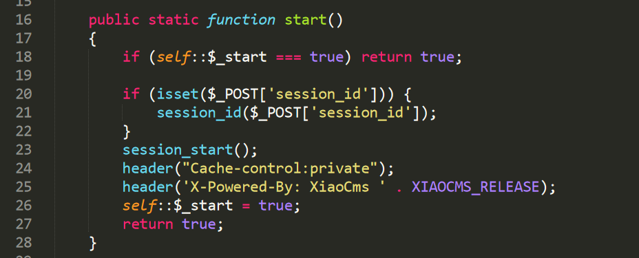

从20行的代码可以知道，如果设置了session_id，那么就会调用session_id()方法将该session_id设置为当前的session_id，而且这个session_id可以用POST方法传输得到。

### 4.1.4 CMS实战演示
测试步骤：
先注册一个只有几个权限的普通管理员账号：quan（其实注册普通用户就行，但是我没找到）
然后用Google浏览器登录quan账号，用Firefox登录admin账号
分别获取相应session_id，得到quan的ssession_id=57049dc90ccd7226302dc8efbb8f2ce0
直接在火狐浏览器用hackbar测试访问：
http://quan.xiaocms.net/admin/?xiaocms
POST:session_id=57049dc90ccd7226302dc8efbb8f2ce0

也可以构造测试POC：
```
<html>
    <body>
    <form action="http://quan.xiaocms.net/admin/" method="post">
    <input type="hidden" name="session_id" value="57049dc90ccd7226302dc8efbb8f2ce0">
    <input type="submit" >
    </form>
</body>
</html>
```
存为html文件，然后用Firefox打开，点击提交查询。

此时打开Google浏览器，可以看到quan管理员的首页状态
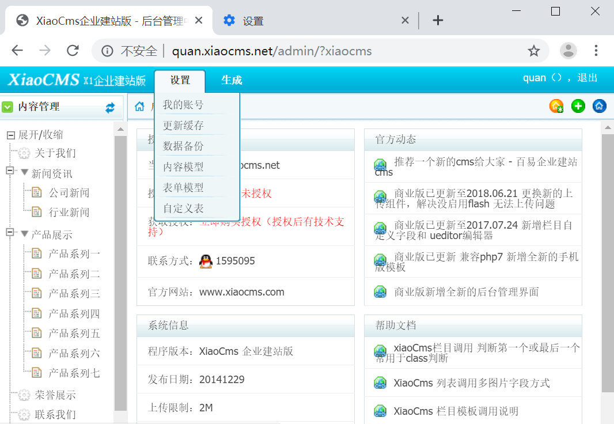

因为quan是管理员用户，所以刷新一下，直接变成超级管理员admin
如果是普通会员用户访问http://quan.xiaocms.net/admin/?xiaocms即可
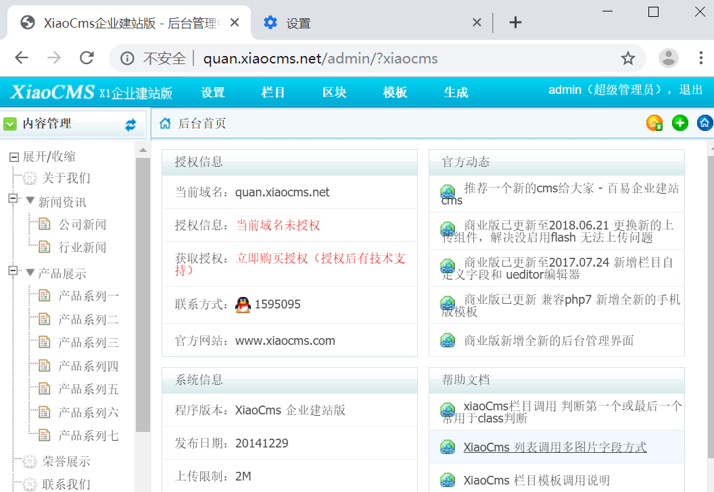

## 4.2 YxCMS
### 4.2.1 CMS介绍
Yxcms是一款高效,灵活,实用,免费的企业建站系统,基于PHP和mysql技术,让您拥有更加专业的企业建站和企业网站制作服务。

### 4.2.2 CMS安装
放入www目录下，一直next即可
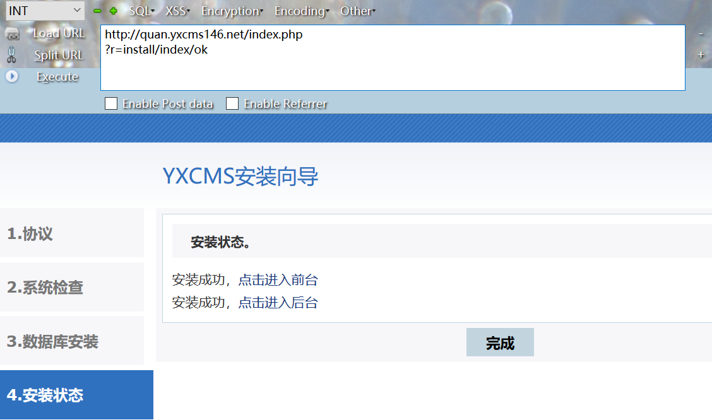

### 4.2.3 CMS漏洞介绍
漏洞发生在此处文件：yxcms/protected/include/lib/common.function.php
漏洞成因：已经存在sessionid时将该sessionid设置为当前sessionid，没有重新生成。
代码分析：
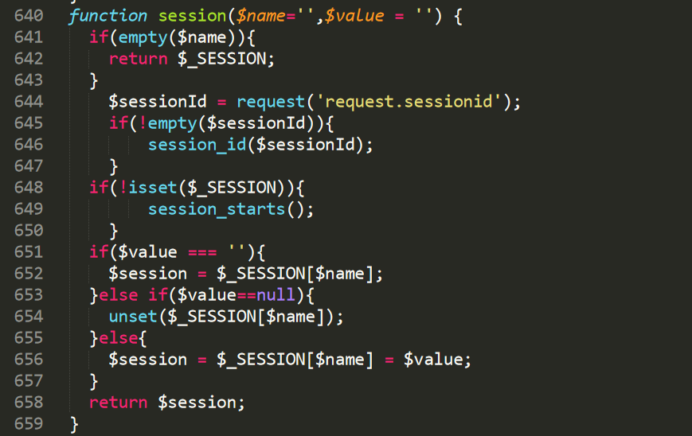

从644行代码可以知道，存在session_id时调用session_id()函数将该session设置为当前，
并且可以从request()函数得到。
再看一下request函数包括哪些方法
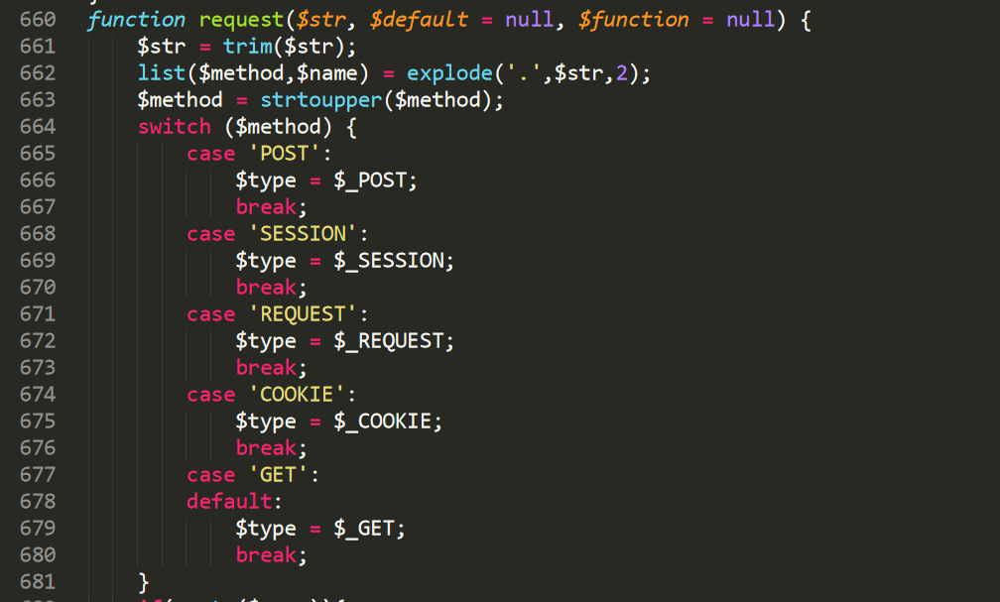

支持挺多的方法传输参数，当然是GET方法最nice~

### 4.2.4 CMS实战演示
后台登陆地址：http://quan.yxcms146.net/index.php?r=admin/index/login
管理员账户：admin/123456
演示过程：
注册一个普通会员用户quan,然后用Google浏览器登录quan账号，用Firefox登录admin账号
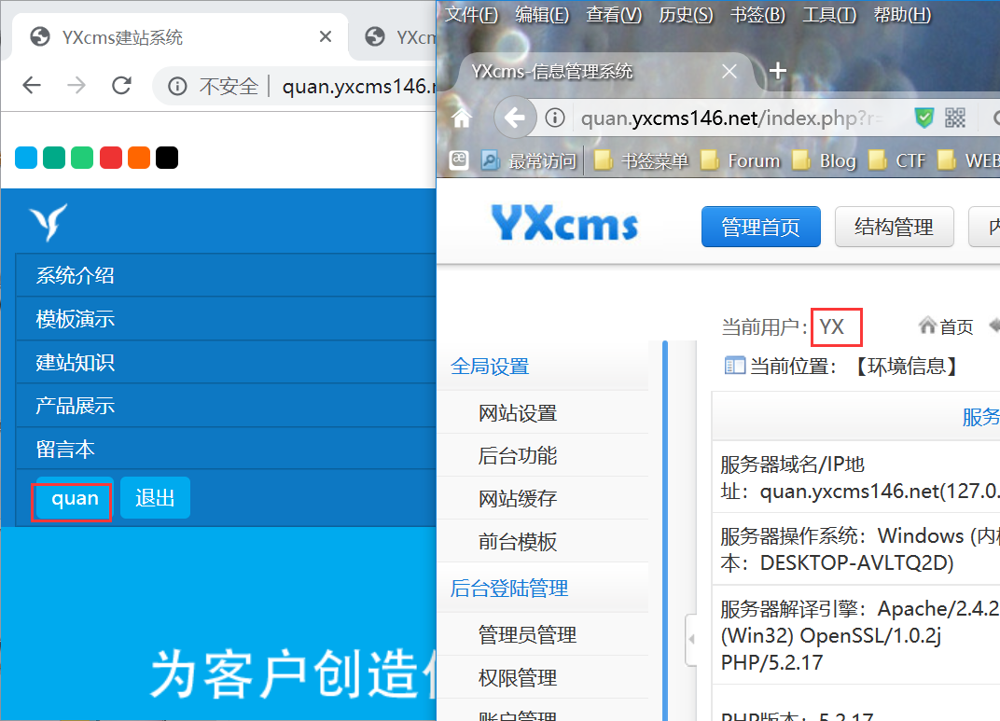

得到PHPSESSID为5fcb75b7b1cda3d797b1cf7ac1cc0be1
直接在admin管理页面加上&sessionid=5fcb75b7b1cda3d797b1cf7ac1cc0be1并访问
在Google浏览器访问http://quan.yxcms146.net/index.php?r=admin/index/index
即可获取admin管理员会话
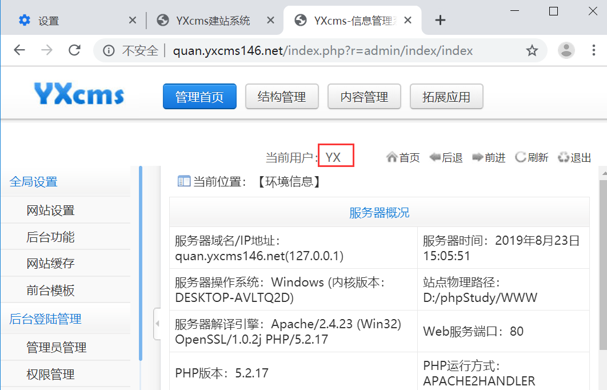

# 5.防御方法
## 5.1服务器端在Set-Cookie时在Cookie的值后面加上一段防篡改的验证串，然后再发送到客户端
## 5.2用户退出系统后，服务器端应清空此用户的Session信息
## 5.3服务器端设置Session的存活时间，超过存活时间强制销毁Session
## 5.4在用户提供的认证信息（例如用户名和密码）、相应的权限级别发生变化时，服务器端应重新生成SessionID，并强制失效之前的会话
