# 1.验证码漏洞概述

## 1.1验证码概述
验证码（CAPTCHA）是“Completely Automated Public Turing test to tell Computers and Humans Apart”（全自动区分计算机和人类的图灵测试）的缩写，是一种区分用户是计算机还是人的公共全自动程序。可以防止：恶意破解?密码、刷票、论坛灌水。由于计算机无法解答CAPTCHA的问题，所以回答出问题的用户就可以被认为是人类。
### 1.1.1验证码作用
有效防止攻击者对某一场景使用暴力方式进行不断的攻击尝试。验证码主要是运用于登录，注册，评论发帖及业务安全防刷等场景。
### 1.1.2验证码分类
#### 1.1.2.1图片验证码
通过在图片上随机产生数字、英文字母、汉字或者问题，一般有四位或者六位验证码字符。通过添加干扰线，添加噪点以及增加字符的粘连程度和旋转角度来增加机器识别的难度。但是这种传统的验证码随着OCR技术的发展，能够轻易的被破解。
#### 1.1.2.2手机短信验证码
手机验证码是通过发送验证码到手机，大型网站尤其是购物网站，都提供有手机短信验证码功能，可以比较准确和安全地保证购物的安全性，验证用户的正确性，是最有效的验证码系统。某些验证码接入商提供手机短信验证码服务，各网站通过接口发送请求到接入商的服务器，服务器发送随机数字或字母到手机中，由接入商的服务器统一做验证码的验证。
#### 1.1.2.3行为式验证码 
是通过用户的某种操作行为来完成验证。例如：拖动式验证码、点触式验证码。
拖动式验证码：类似于手机的滑动解锁，根据提示用鼠标将滑块拖动到指定的位置完成验证。
点触式验证码，同样根据文字提示，点击图片中与文字描述相符的内容完成验证。
#### 1.1.2.4语音验证码
是通过语音电话直接呼叫用户手机或固定电话播报验证码，解决短信验证码到达率及政策性问题。常用于网站、移动客户端、银行金融等用户身份验证，以及支付确认等安全性要求更高的即时服务。
#### 1.1.2.5视频验证码
是验证码中的新秀，视频验证码中随机数字、字母和中文组合而成的验证码动态嵌入到MP4，flv等格式的视频中，增大了破解难度。验证码视频动态变换，随机响应，可以有效防范字典攻击、穷举攻击等攻击行为。

## 1.2验证码漏洞概述

### 1.2.1漏洞原理
由于验证码生成机制或验证机制存在缺陷引发的问题。

### 1.2.2漏洞危害
#### 1.2.2.1对账户进行暴力破解
#### 1.2.2.2 任意用户登录
#### 1.2.2.3 短信轰炸

# 2.常见验证码漏洞

## 2.1通用设计缺陷
### 2.1.1验证码无效
无论输入什么都判断验证码正确，这种情况非常少，一些小站点可能存在。

### 2.1.2验证码由客户端生成、验证
验证码由客户端js生成并且仅仅在客户端用js验证
测试：判断验证码是否仅由客户端验证。
Eg:下图为验证码仅由客户端验证案例
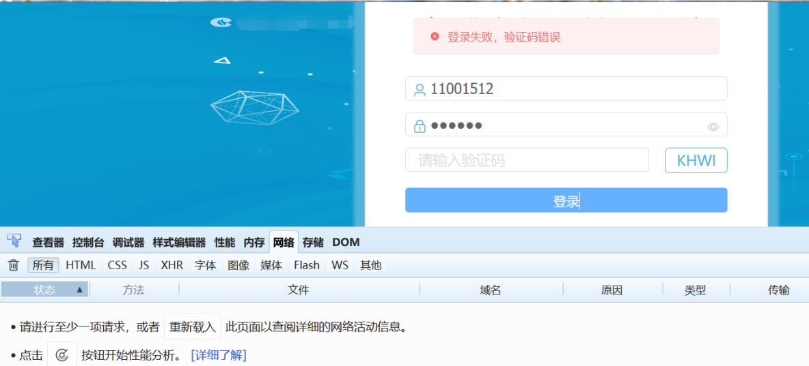

### 2.1.3验证码回显
验证码在html或COOKIE中显示，或输出到response headers的其他字段。可被直接查看。
测试：可查看html源码或对响应包进行分析。
Eg:下图为验证码在COOKIE中回显案例
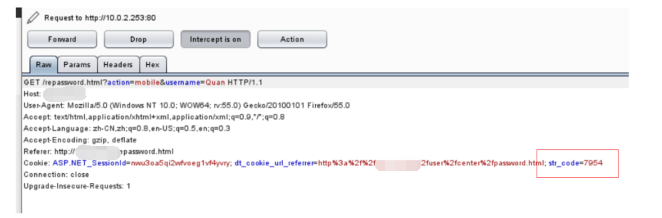

### 2.1.4验证码固定
也叫验证码重复使用（重用）。是指验证码没有设使用期限，在验证码首次认证成功后没有删除session中的验证码，使得该验证码可被多次成功验证，从而造成危害。
测试：填写正确登录信息和验证码然后抓取提交数据包，重复提交该数据包，登录成功则存在验证码重复使用问题。
ps:可通过修改与验证码无关的参数的大小来实现多次提交，自设一个字典作为该参数payload。
Eg：EmpireCMS_6.0后台验证码可重复使用

从结果来看，暴力重复提交的数据包均登录成功，说明存在验证码重复使用的问题。
再附上项目中遇到的验证码重用问题
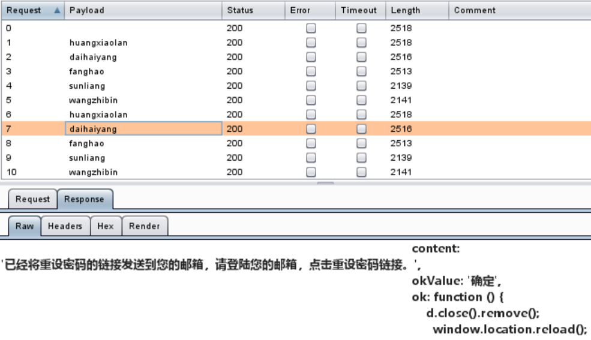

### 2.1.5 验证码可爆破
服务端未对验证时间、次数作出限制，存在爆破的可能性。简单的系统存在可以直接爆破的可能性，但做过一些防护的系统还得进行一些绕过才能进行爆破。
测试：利用Burpsuite对验证码参数进行暴力破解。
Eg：微信验证码暴力破解可导制任意密码修改：
http://www.wooyun.org/bugs/wooyun-2010-011720

### 2.1.6 验证码可猜测
由于验证码设置比较简单，可能只有数字或字母组成，也可能是其设定范围有限，导致验证码内容可被猜测。经常出现在图片验证码问题集场景。
测试：根据已有验证码对验证码设定范围进行猜测。
Eg：产生的验证码问题集内的答案非常有限
139邮箱图验证码绕过漏洞 http://www.wooyun.org/bugs/wooyun-2013-025245

### 2.1.7 验证码可绕过
由于逻辑设计缺陷，可绕过验证，常见绕过方式如直接删除COOKIE、验证码参数为空、直接删除验证码参数可绕过和修改Response状态值等。也可根据情况组合以上绕过方式。
测试：利用Burpsuite更改请求包数据进行多次测试。
Eg1:CmsEasyv5.5删除COOKIE可绕过验证

Eg2:验证码参数值为空可绕过验证
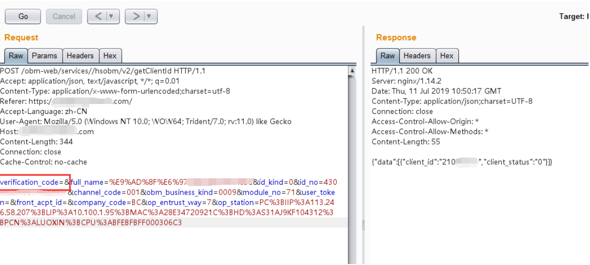

## 2.2图片验证码
除了上述通用设计缺陷，由于图形验证码设计过于简单，可使用工具自动化识别，存在图片验证码可自动识别漏洞。
测试：利用Python Image Library、tesseract-ocr、pytesser等python第三方库，经过二值化、文字分割等操作识别验证码。
Eg：招商银行设计缺陷可被穷举攻击
http://www.wooyun.org/bugs/wooyun-2015-092497
光大证券交易系统资金账号可被穷举攻击
http://www.wooyun.org/bugs/wooyun-2015-092415

## 2.3短信验证码
很多系统的短信验证码接口存在很多逻辑问题，因此产生的危害也很多，比如任意用户注册、任意用户重置密码、短信轰炸等，还可能导致CSRF。
短信验证码漏洞常出现在注册登录、密码找回、敏感信息修改、获取等模块。

### 2.3.1短信轰炸
这类漏洞存在的原因是没有对短信验证码的发送时间、用户及其IP作一些限制。
测试：抓包后利用burpsuite的重放功能，结果均返回已发送成功。

### 2.3.2任意用户注册
没有将短信验证码与手机绑定，通过更改手机号填写

### 2.3.3任意用户重置密码
一般出现在密码找回模块，系统没有将发送的短信验证码与手机绑定，可通过更改手机号获取验证码进行绕过，重置和登录该用户账号密码。
但也有情况就是，系统将发送的短信验证码与手机绑定了，但没有将该手机号和相应账号
进行绑定，还是可以绕过验证码的。
Eg:下图就是一个通过修改手机号获取验证码的场景，但比较特别的是必须将mobile改为接收captcha的手机号才能验证成功。
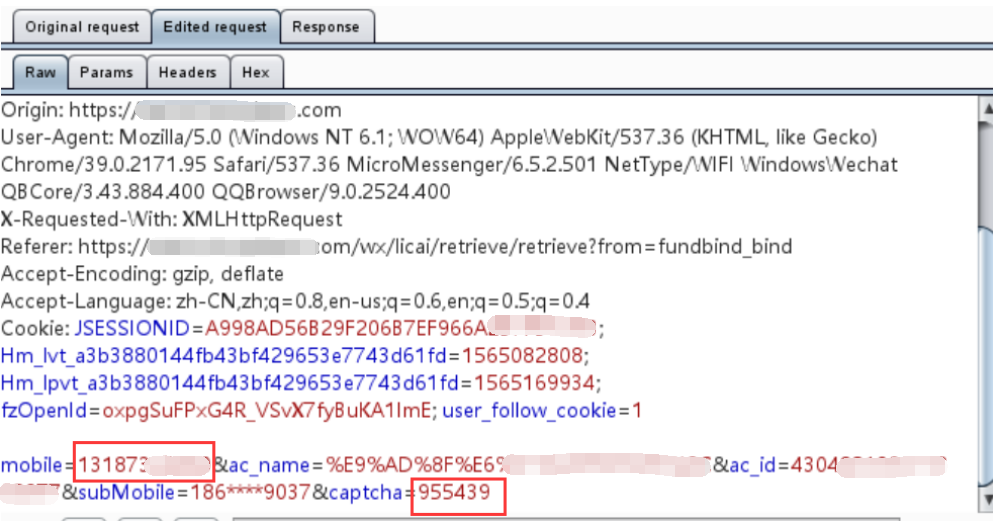

# 3.测试
这里先介绍测试靶场，
## 3.1靶场测试
### 3.1.1 Pikachu漏洞平台
#### 3.1.1.1 靶场介绍
Pikachu是一个带有漏洞的Web应用系统，在这里包含了常见的web安全漏洞。 ・  Burt Force(暴力破解漏洞)
・  XSS(跨站脚本漏洞)
・  CSRF(跨站请求伪造)
・  SQL-Inject(SQL注入漏洞)
・  RCE(远程命令/代码执行)
....
#### 3.1.2.2 靶场下载
https://github.com/zhuifengshaonianhanlu/pikachu
#### 3.1.2.3靶场安装
放到WWW目录下，然后在inc/config.inc.php中修改数据库名和密码
访问http://localhost/pikachu-master/进入首页，点击初始化安装

安装成功
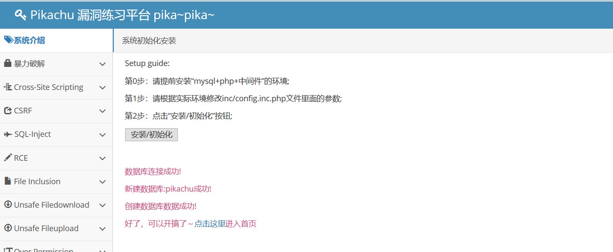

## 3.2 手工测试
在Pikachu漏洞平台首页选择暴力破解|验证码绕过(on server)/(o client)。
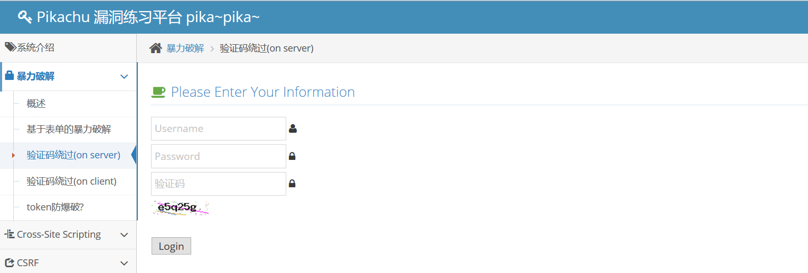

### 3.2.1验证码绕过(on server)
按照2.1的通用设计缺陷一个个进行测试。
测试结果：验证码有验证、无回显，但存在验证码固定（可重复使用）的设计缺陷。
以下为验证码固定问题测试过程和源码分析。

#### 3.2.1.1 测试过程
输入不正确的账户/密码及正确的验证码测试

重复提交该数据包均只返回用户名或密码错误，说明存在验证码固定漏洞。
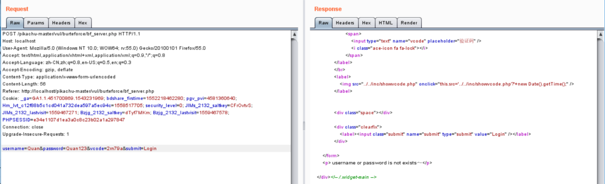

所以我们可利用此漏洞绕过验证码直接对用户名和密码进行暴力破解。
#### 3.2.1.2源码分析
文件：\vul\burteforce\bf_server.php
关键代码：
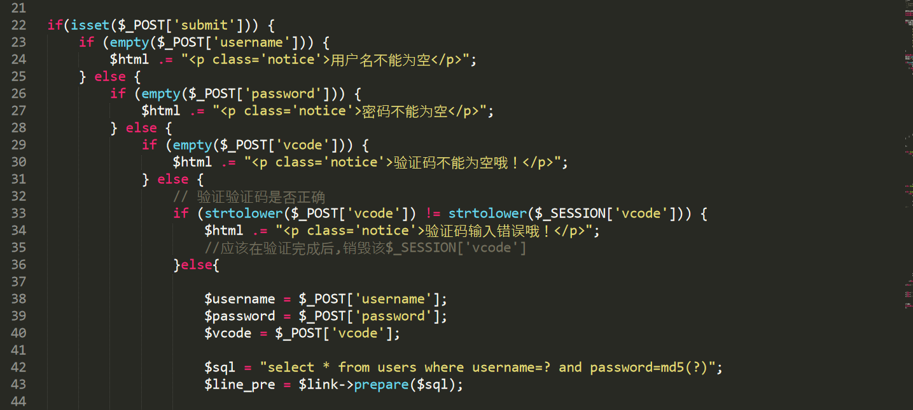

在用户名、密码和验证码均不为空的情况下判断输入验证码是否与生成后保存在session中的验证码相同，但比较完后没有删除该session[vcode],导致下一个数据包输入该验证码也会判断正确，出现验证码重复使用问题。
3.2.2验证码绕过(on client)
按照2.1的通用设计缺陷一个个进行测试。
测试结果：验证码有验证、无回显，在测试验证码固定（可重复使用）问题抓包时发现是通过前端JS判断验证码是否正确，在bp中测试发现存在删除验证码参数可绕过验证码判断的问题。
以下为验证码固定问题测试过程和源码分析。
#### 3.2.2.1 测试过程
通过查看源码发现前端JS判断验证码是否正确，所以先输入正确的验证码绕过前端判断。
输入不正确的账户/密码及验证码进行抓包测试。
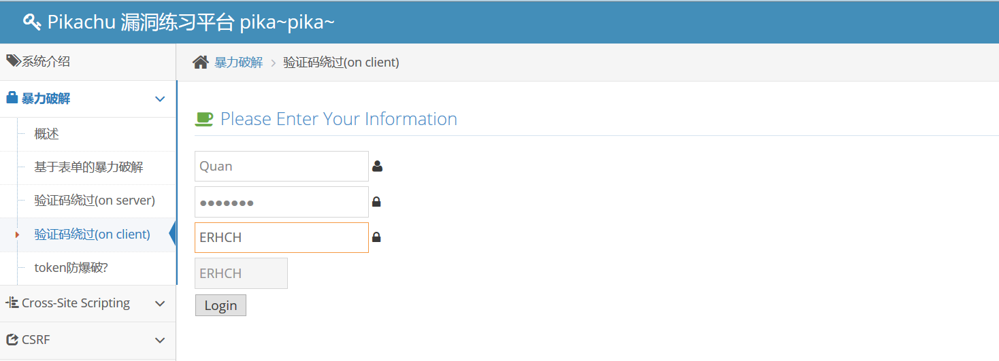

由于已经绕过前端js对验证码的判断，可以将请求包中的验证码参数删除。
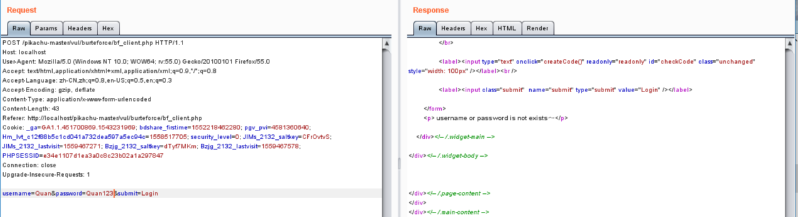

再将数据包发送到intruder对用户名和密码进行暴力破解即可。

## 3.3工具测试
### 3.3.1 PKAV HTTP Fuzzer
#### 3.3.1.1 工具介绍
pkav团队的神器PKAV HTTP Fuzzer可对图片验证码进行识别。
不需要安装可直接运行，但运行需要安装.net framework 4.0或以上版本。
#### 3.3.1.2 测试过程
这里用PKAV HTTP Fuzzer对EmpireCMS_6.0进行测试。
安装好后先登录后台页面修改后台验证码显示设置
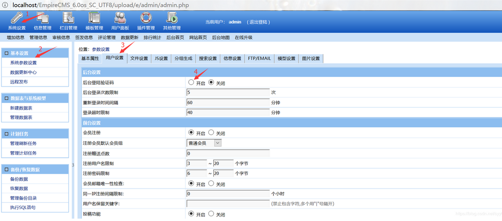

先用burpsuite抓取登录包，再将url和请求包复制到PKav->目标数据的相应位置
设置变量和验证码
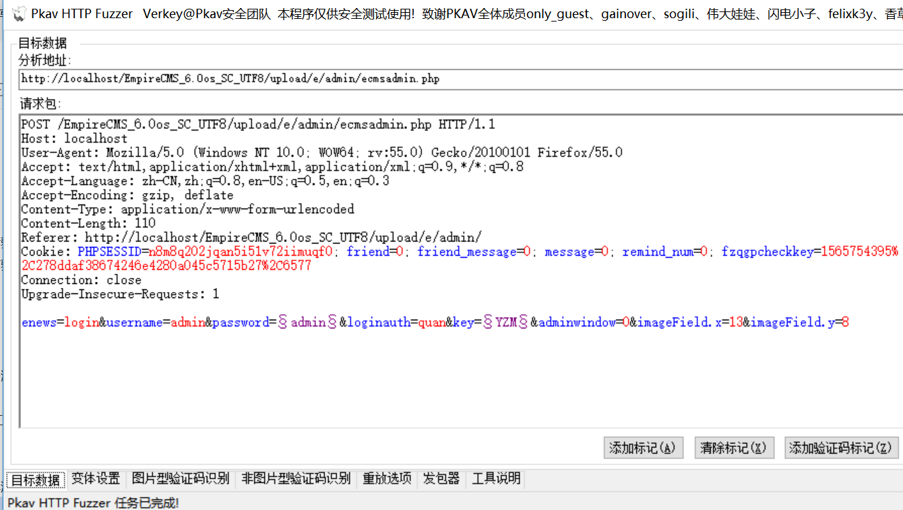

然后添加变量的字典，设置重放方式
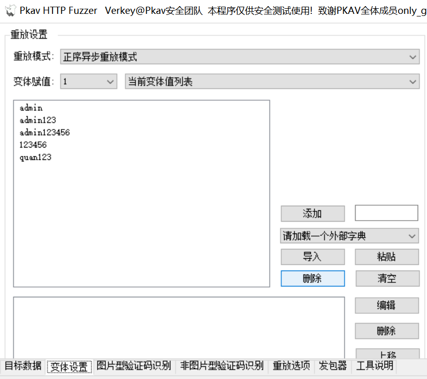

由于该cms的验证码为图片验证码，所以我们再进入图片验证码识别进行设置。
右键复制图片验证码链接地址，填写到验证码地址
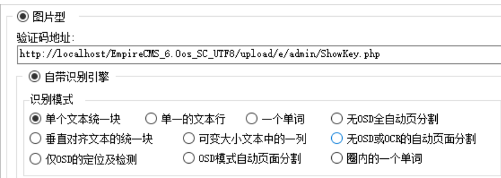

往下点击识别测试查看是否能识别
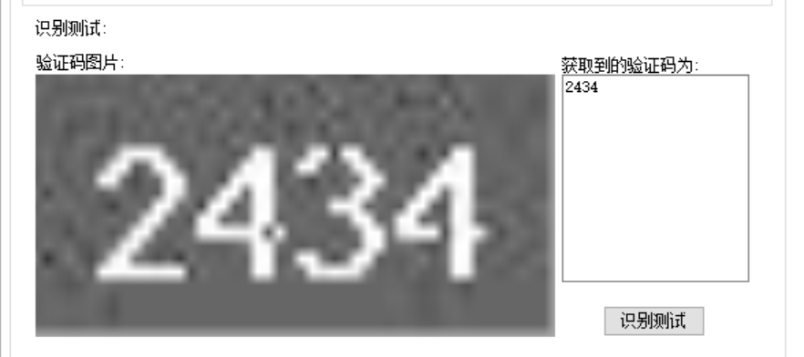

再进入重放选项对线程、验证码长度进行设置，也可设置响应包字段匹配方便判断。
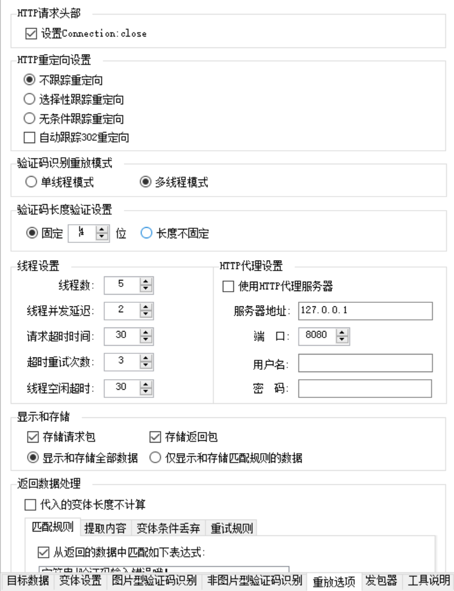

最后进入发包器模块点击启动即可。
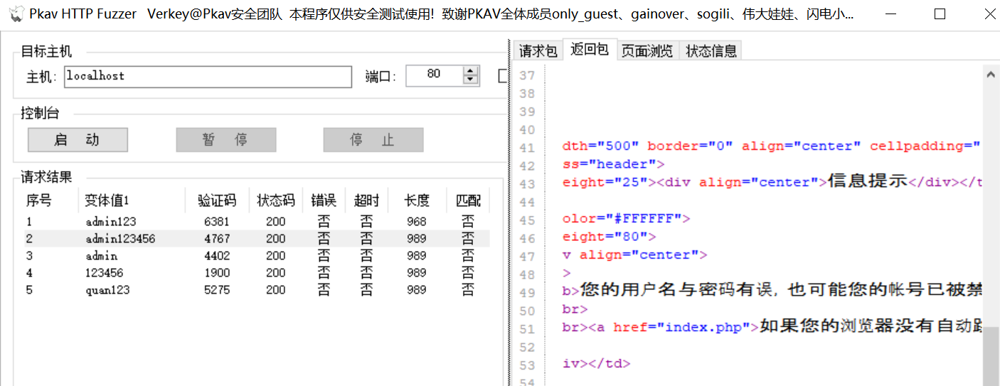

### 3.3.2 Burp插件reCAPTCHA
#### 3.3.2.1插件介绍

#### 3.3.2.2插件安装
下载地址：https://github.com/bit4woo/reCAPTCHA/releases
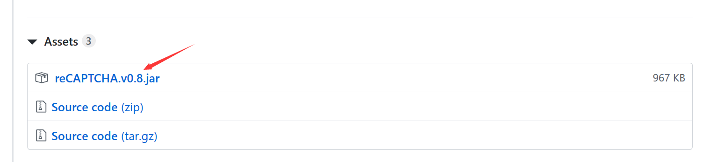

安装：在Burpsuite中选择Extender->Extensions->Add，选择刚下载的reCAPTCHA.v0.8即可。
在Proxy中右键出现Send to reCAPTCHA即安装成功。
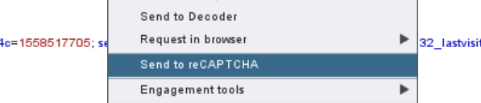
使用方法这里就不做介绍了

# 4.CMS实战演练
## 4.1CMSeasyv5.5删除cookie可绕过验证码
### 4.1.1 cms简介
CmsEasy是一款基于 PHP+Mysql 架构的网站内容管理系统，也是一个 PHP 开发平台。 采用模块化方式开发，功能易用便于扩展，可面向大中型站点提供重量级网站建设解决方案。2年来，凭借 团队长期积累的丰富的Web开发及数据库经验和勇于创新追求完美的设计理念，使得 CmsEasy v1.0 得到了众多网站的认可，并且越来越多地被应用到大中型商业网站。
### 4.1.2 测试环境
系统：win10
PHPStudy：PHPv5.2.17+MYSQLv5.5.53
CMS版本：CMSeasyv5.5
### 4.1.3 测试过程
访问http://xxx/uploads/admin/跳转到后台登陆页面。

使用正确账户密码+错误验证码尝试登录时，返回验证码错误
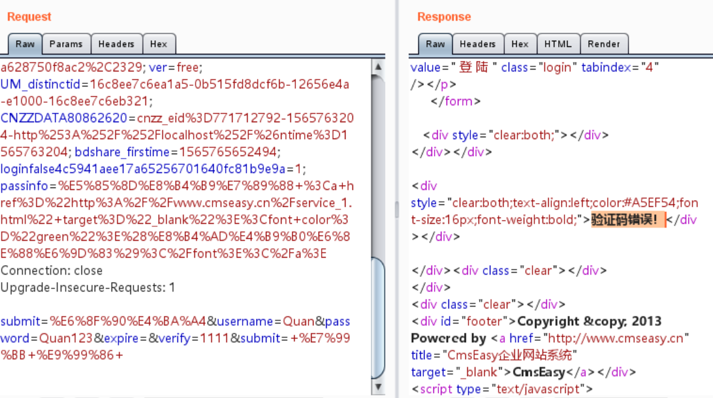

删除cookie后返回登陆成功

因此非管理员用户可通过删除cookie绕过验证码验证对用户名和密码进行爆破。

## 4.2 EmpireCMS_6.0验证码重复
### 4.2.1 CMS介绍
帝国网站管理系统(EmpireCMS)是目前国内应用最广泛的CMS程序。通过十多年的不断创新与完善，使系统集安全、稳定、强大、灵活于一身。目前EmpireCMS程序已经广泛应用在国内上百万家网站，覆盖国内上千万上网人群，并经过上千家知名网站的严格检测，被称为国内超高安全稳定的开源CMS系统。
### 4.2.2 测试环境
系统：win10
PHPStudy：PHPv5.2.17+MYSQLv5.5.53
CMS版本：EmpireCMS_6.0

### 4.2.3安装CMS
访问http://yoursite/e/install/index.php
安装好后先登录后台页面修改后台验证码显示设置，步骤如图
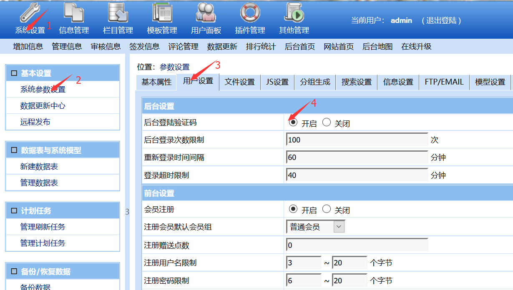

然后拉到最下方保存设置，退出登录
### 4.2.4测试过程
第一步，输入正确信息点击登录时抓包
第二步，通过修改imageField参数的大小来实现暴力提交，自设一个两位数数字字典作为payload

第三步，查看任意响应包是否登录成功
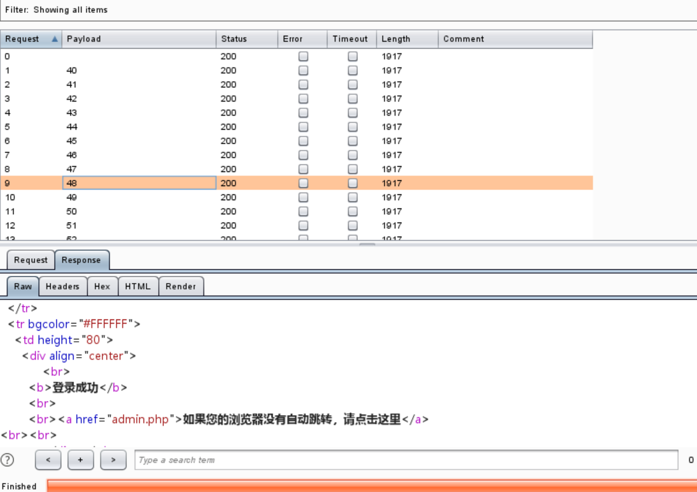

从结果来看，暴力重复提交的数据包均登录成功，说明存在验证码重复使用的问题。
经过暴力重复提交后，后台显示登陆成功。
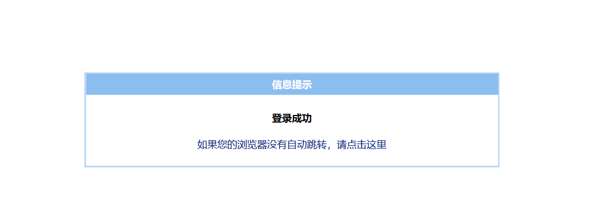

# 5.修复建议
## 5.1使用安全性强的验证码
验证码应从以下方面保证其安全性：验证码长度不低于4位，至少同时包含数字、字母或汉字，增加干扰因素比如线条，避免使用容易被程序自动识别的验证码。
## 5.2 验证码不应由客户端生成或返回到客户端
## 5.3 系统在开发时注意验证识别后销毁session中的验证码。
## 5.4限制用户提交的验证码不能为空
## 5.5 短信验证码不少于6位；有效期不超过1分钟；验证码错误次数超过上限应采取账户锁定策略。
